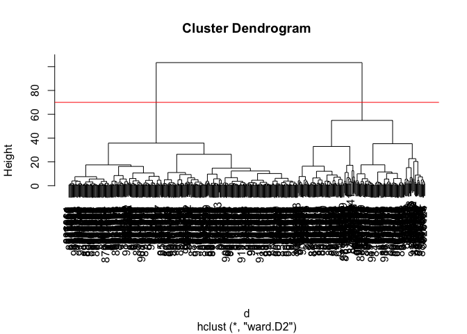

# Lab 08: Mini-project
Qingyun Zheng (A16338254)

- [Background](#background)
- [Data Import](#data-import)
- [Principal Component Analysis](#principal-component-analysis)
- [Interpreting PCA results](#interpreting-pca-results)
- [Variance explained](#variance-explained)
- [Communicating PCA results](#communicating-pca-results)
- [Hierarchical Clustering](#hierarchical-clustering)
- [Q10. Using the plot() and abline() functions, what is the height at
  which the clustering model has 4
  clusters?](#q10-using-the-plot-and-abline-functions-what-is-the-height-at-which-the-clustering-model-has-4-clusters)
- [Using different methods](#using-different-methods)
- [Combining PCA and Clustering](#combining-pca-and-clustering)

## Background

The goal of this mini-project is for us to explore a complete analysis
using the unsupervised learning techniques covered in the last class.
We’ll extend what you’ve learned by combining PCA as a preprocessing
step to clustering using data that consist of measurements of cell
nuclei of human breast masses. This expands on our RNA-Seq analysis from
last day.

The data itself comes from the Wisconsin Breast Cancer Diagnostic Data
Set first reported by K. P. Benne and O. L. Mangasarian: “Robust Linear
Programming Discrimination of Two Linearly Inseparable Sets”.

Values in this data set describe characteristics of the cell nuclei
present in digitized images of a fine needle aspiration (FNA) of a
breast mass.

## Data Import

``` r
wisc.df <- read.csv("WisconsinCancer.csv", row.names = 1)
```

Make sure we do not include sample id or diagnosis columns in the data
that we analyze nbelow

``` r
diagnosis <- as.factor(wisc.df$diagnosis)
wisc.data <- wisc.df[,-1]
dim(wisc.data)
```

    [1] 569  30

``` r
nrow(wisc.data)
```

    [1] 569

> Q1. How many observations are in this dataset? There are 569
> observations in the dataset

``` r
table(diagnosis)
```

    diagnosis
      B   M 
    357 212 

``` r
sum(diagnosis == "M")
```

    [1] 212

> Q2. How many of the observations have a malignant diagnosis? There are
> 212 maglinant diagnosis

``` r
length(grep("_mean", colnames(wisc.data)))
```

    [1] 10

> Q3. How many variables/features in the data are suffixed with \_mean?
> There are 10 that are suffixed with \_mean

## Principal Component Analysis

The main function in base R for PCA is called `prcomp()`. A optional
argument `scale` should nearly always be switched to `scale = TRUE` for
this function.

``` r
wisc.pr <- prcomp(wisc.data, scale = TRUE)
summary(wisc.pr)
```

    Importance of components:
                              PC1    PC2     PC3     PC4     PC5     PC6     PC7
    Standard deviation     3.6444 2.3857 1.67867 1.40735 1.28403 1.09880 0.82172
    Proportion of Variance 0.4427 0.1897 0.09393 0.06602 0.05496 0.04025 0.02251
    Cumulative Proportion  0.4427 0.6324 0.72636 0.79239 0.84734 0.88759 0.91010
                               PC8    PC9    PC10   PC11    PC12    PC13    PC14
    Standard deviation     0.69037 0.6457 0.59219 0.5421 0.51104 0.49128 0.39624
    Proportion of Variance 0.01589 0.0139 0.01169 0.0098 0.00871 0.00805 0.00523
    Cumulative Proportion  0.92598 0.9399 0.95157 0.9614 0.97007 0.97812 0.98335
                              PC15    PC16    PC17    PC18    PC19    PC20   PC21
    Standard deviation     0.30681 0.28260 0.24372 0.22939 0.22244 0.17652 0.1731
    Proportion of Variance 0.00314 0.00266 0.00198 0.00175 0.00165 0.00104 0.0010
    Cumulative Proportion  0.98649 0.98915 0.99113 0.99288 0.99453 0.99557 0.9966
                              PC22    PC23   PC24    PC25    PC26    PC27    PC28
    Standard deviation     0.16565 0.15602 0.1344 0.12442 0.09043 0.08307 0.03987
    Proportion of Variance 0.00091 0.00081 0.0006 0.00052 0.00027 0.00023 0.00005
    Cumulative Proportion  0.99749 0.99830 0.9989 0.99942 0.99969 0.99992 0.99997
                              PC29    PC30
    Standard deviation     0.02736 0.01153
    Proportion of Variance 0.00002 0.00000
    Cumulative Proportion  1.00000 1.00000

``` r
summary(wisc.pr)$importance[2,1]
```

    [1] 0.44272

``` r
pr.var <- wisc.pr$sdev^2
round(pr.var/sum(pr.var)*100)
```

     [1] 44 19  9  7  5  4  2  2  1  1  1  1  1  1  0  0  0  0  0  0  0  0  0  0  0
    [26]  0  0  0  0  0

> Q4. From your results, what proportion of the original variance is
> captured by the first principal components (PC1)? 44% of original
> variance is captured by PC1

``` r
cumvar <- summary(wisc.pr)$importance[3,]
which(cumvar >= 0.7)[1]
```

    PC3 
      3 

``` r
which(cumvar >= 0.9)[1]
```

    PC7 
      7 

> Q5. How many principal components (PCs) are required to describe at
> least 70% of the original variance in the data? Three PCs are required
> to describe at least 70% of the original variance

> Q6. How many principal components (PCs) are required to describe at
> least 90% of the original variance in the data? 7 PCs are required for
> 90% of the original variance

## Interpreting PCA results

Now I will use some visualizations to better understand my PCA model. A
common visualization for PCA results is the so-called biplot.

Create a biplot of the wisc.pr using the `biplot()` function

``` r
biplot(wisc.pr)
```


> Q7. What stands out to you about this plot? Is it easy or difficult to
> understand? Why? HINT:This is a hot mess of a plot and we will need to
> generate our own plots to make sense of this PCA result. The biplot is
> quite cluttered and difficult to interpret due to the large number of
> variables. It’s hard to discern relationships between variables and
> observations.

I will make a scatterplot instead

``` r
plot(wisc.pr$x, col = diagnosis,
     xlab = "PC1", ylab = "PC2")
```


> Q8. Generate a similar plot for principal components 1 and 3. What do
> you notice about these plots?

``` r
plot(wisc.pr$x[,c(1,3)], col = diagnosis,
     xlab = "PC1", ylab = "PC3")
```


> The plot of PC1 vs PC3 shows a slightly different distribution of
> points compared to PC1 vs PC2. PC3 captures different aspects of the
> data, and the separation between malignant and benign cases may be
> more or less pronounced depending on the components chosen.

Let’s make our main result figure - the “PC plot” or “socre plot”, etc.
with ggplot:

``` r
library(ggplot2)
ggplot(wisc.pr$x, aes(PC1, PC2, col = diagnosis))+
  geom_point()
```


## Variance explained

In this exercise, you will produce scree plots showing the proportion of
variance explained as the number of principal components increases. The
data from PCA must be prepared for these plots, as there is not a
built-in function in base R to create them directly from the PCA model.

Calculate the variance of each principal component by squaring the sdev
component of wisc.pr

``` r
pr.var <- wisc.pr$sdev^2
head(pr.var)
```

    [1] 13.281608  5.691355  2.817949  1.980640  1.648731  1.207357

Calculate the variance explained by each principal component by dividing
by the total variance explained of all principal components.

``` r
# Variance explained by each principal component: pve
pve <- pr.var/sum(pr.var)
# Plot variance explained for each principal component
plot(pve, xlab = "Principal Component",
     ylab = "Proportion of Variance Explained",
     ylim = c(0, 1), type = "o")
```


``` r
# Alternative scree plot of the same data, note data driven y-axis
barplot(pve, ylab = "Precent of Variance Explained",
     names.arg=paste0("PC",1:length(pve)), las=2, axes = FALSE)
axis(2, at=pve, labels=round(pve,2)*100 )
```


## Communicating PCA results

The loadings, represented as vectors, explain the mapping from the
original features to the principal components. The principal components
are naturally ordered from the most variance explained to the least
variance explained.

> Q9. For the first principal component, what is the component of the
> loading vector (i.e. wisc.pr\$rotation\[,1\]) for the feature
> concave.points_mean? This tells us how much this original feature
> contributes to the first PC.

``` r
wisc.pr$rotation["concave.points_mean", 1]
```

    [1] -0.2608538

> concave.points_mean contributes fairly strongly and negatively to PC1.

## Hierarchical Clustering

``` r
data.scaled <- scale(wisc.data)
data.dist <- dist(data.scaled)
wisc.hclust <- hclust(data.dist, method = "complete")
plot(wisc.hclust)
```


## Q10. Using the plot() and abline() functions, what is the height at which the clustering model has 4 clusters?

``` r
plot(wisc.hclust)
abline(h=19, col="red", lty=2)
```


> The height at which the clustering model has 4 clusters is
> approximately 19.

## Using different methods

As we discussed in our last class videos there are number of different
“methods” we can use to combine points during the hierarchical
clustering procedure. These include “single”, “complete”, “average” and
(my favorite) “ward.D2”

> Q12. Which method gives your favorite results for the same data.dist
> dataset? Explain your reasoning.

``` r
wisc.hclust <- hclust(data.dist, method = "single")
plot(wisc.hclust)
```


``` r
wisc.hclust <- hclust(data.dist, method = "average")
plot(wisc.hclust)
```


``` r
wisc.hclust <- hclust(data.dist, method = "ward.D2")
plot(wisc.hclust)
```


> I also like ward.D2 method as it tends to create more balanced
> clusters and minimizes the total within-cluster variance.

## Combining PCA and Clustering

``` r
d <- dist(wisc.pr$x[,1:3])
wisc.pr.hclust <- hclust(d, method = "ward.D2") 
plot(wisc.pr.hclust)
abline(h=70, col = "red")
```



``` r
grps <- cutree(wisc.pr.hclust, h=70)
table(grps)
```

    grps
      1   2 
    203 366 

``` r
table(diagnosis)
```

    diagnosis
      B   M 
    357 212 

Make a wee”cross-table”

``` r
table(grps, diagnosis)
```

        diagnosis
    grps   B   M
       1  24 179
       2 333  33

This could mean something like: True positive (TP) = 179 False positive
(FP) = 24

sensitivity = TP / (TP + FN)

``` r
plot(wisc.pr$x[,1:2], col=grps)
```


``` r
plot(wisc.pr$x[,1:2], col=diagnosis)
```


``` r
## Use the distance along the first 7 PCs for clustering i.e. wisc.pr$x[, 1:7]
d <- dist(wisc.pr$x[,1:7])
wisc.pr.hclust <- hclust(d, method = "ward.D2") 
plot(wisc.pr.hclust)
```


``` r
#Cut this hierarchical clustering model into 2 clusters and assign the results to wisc.pr.hclust.clusters
wisc.pr.hclust.clusters <- cutree(wisc.pr.hclust, k=2)
#Using table(), compare the results from your new hierarchical clustering model with the actual diagnoses.
table(wisc.pr.hclust.clusters, diagnosis)
```

                           diagnosis
    wisc.pr.hclust.clusters   B   M
                          1  28 188
                          2 329  24

> Q13. How well does the newly created model with four clusters separate
> out the two diagnoses? The model with four clusters shows a good
> separation between the two diagnoses, with most malignant cases
> grouped together and benign cases in separate clusters.

> Q14. How well do the hierarchical clustering models you created in
> previous sections (i.e. before PCA) do in terms of separating the
> diagnoses? Again, use the table() function to compare the output of
> each model (wisc.km\$cluster and wisc.hclust.clusters) with the vector
> containing the actual diagnoses.

``` r
wisc.hclust <- hclust(data.dist, method = "ward.D2")
wisc.hclust.clusters <-cutree(wisc.hclust, k=2)
table(wisc.hclust.clusters, diagnosis)
```

                        diagnosis
    wisc.hclust.clusters   B   M
                       1  20 164
                       2 337  48

> The hierarchical clustering models created before PCA also show a
> reasonable separation of diagnoses, but the clustering based on PCA
> components tends to provide a clearer distinction between malignant
> and benign cases.
