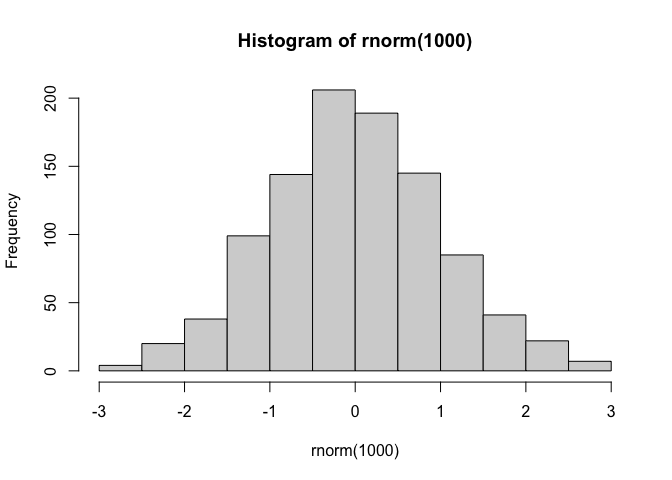
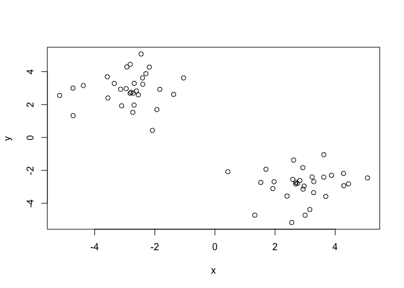
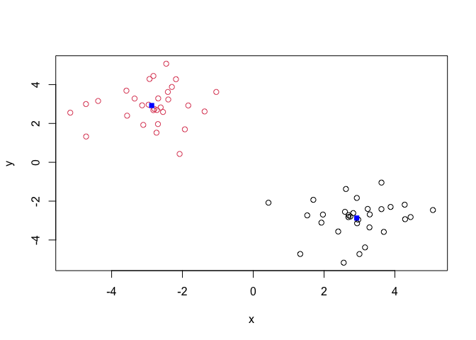
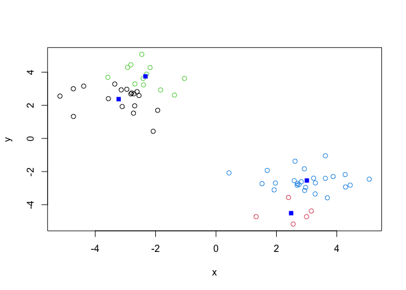
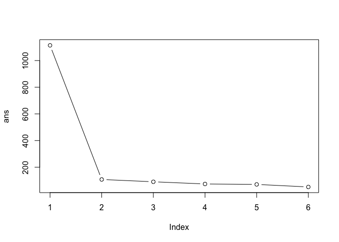
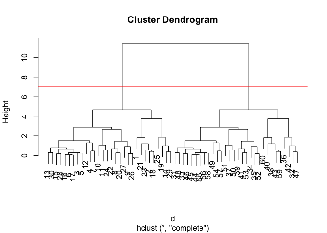
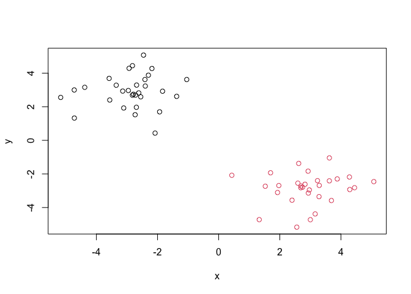
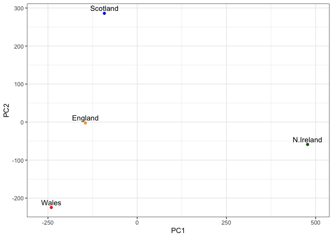
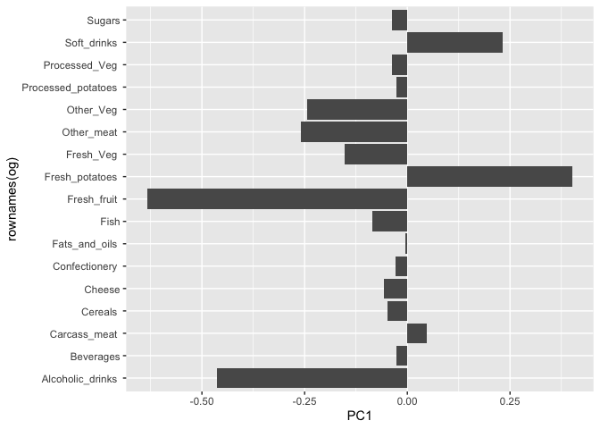

# Class 07: Machine Learning 1
Qingyun Zheng (A16338254)

Today we wll begin our exploration of some “classical” machine learning
approaches. We’ll start with clustering:

Let’s first make up some data cluster where we know what the answer
should be

``` r
hist(rnorm(1000))
```



``` r
x <- c(rnorm(30, -3), rnorm(30, 3))
y <- rev(x)
z <- cbind(x,y)
```

Let’s plot z using `plot()`

``` r
plot(z)
```



The main function in “base” R for k-means clustering is called
`kmeans()`

``` r
k <- kmeans(z,centers = 2)
k
```

    K-means clustering with 2 clusters of sizes 30, 30

    Cluster means:
              x         y
    1  2.922032 -2.868746
    2 -2.868746  2.922032

    Clustering vector:
     [1] 2 2 2 2 2 2 2 2 2 2 2 2 2 2 2 2 2 2 2 2 2 2 2 2 2 2 2 2 2 2 1 1 1 1 1 1 1 1
    [39] 1 1 1 1 1 1 1 1 1 1 1 1 1 1 1 1 1 1 1 1 1 1

    Within cluster sum of squares by cluster:
    [1] 54.04894 54.04894
     (between_SS / total_SS =  90.3 %)

    Available components:

    [1] "cluster"      "centers"      "totss"        "withinss"     "tot.withinss"
    [6] "betweenss"    "size"         "iter"         "ifault"      

> Q. How big are the clusters (i.e. their size)?

``` r
k$size
```

    [1] 30 30

> Q. What clusteres do my data points reside in?

``` r
k$cluster
```

     [1] 2 2 2 2 2 2 2 2 2 2 2 2 2 2 2 2 2 2 2 2 2 2 2 2 2 2 2 2 2 2 1 1 1 1 1 1 1 1
    [39] 1 1 1 1 1 1 1 1 1 1 1 1 1 1 1 1 1 1 1 1 1 1

> Q. Make a plot of our data of colored by cluster assignment - make a
> result figure

``` r
plot(z, col = k$cluster)
points(k$centers, col = "blue", pch = 15)
```



> Q. Clustering with k-means into 4 clusters and plot your results as
> above

``` r
k4 <- kmeans(z, centers = 4)
plot(z, col = k4$cluster)
points(k4$centers, col = "blue", pch = 15)
```



> Run K-means with centers (values of k) equal to 1 to 6

``` r
ans <- NULL
for(i in 1:6){
  ans <- c(ans, kmeans(z, centers = i)$tot.withinss)
}
ans
```

    [1] 1114.09131  108.09789   90.77261   74.38152   71.06209   51.92644

``` r
plot(ans, typ = "b")
```



## Hierarchial clustering

The main function in “base” R for this in called `hclust()`

``` r
d <- dist(z)
hc <- hclust(d)
hc
```


    Call:
    hclust(d = d)

    Cluster method   : complete 
    Distance         : euclidean 
    Number of objects: 60 

``` r
plot(hc)
abline(h=7, col = "red")
```



To obtain clusters from hour `hclust` result object **hc** we “cut the
tree to yield different sub branches. For this we use the `cutree()`
function

``` r
grps <- cutree(hc, h=7)
plot(z, col= grps)
```



## Principal component Analysis (PCA)

``` r
url <- "https://tinyurl.com/UK-foods"
x <- read.csv(url)
```

> Q1. How many rows and columns are in your new data frame named x? What
> R functions could you use to answer this questions?

``` r
dim(x)
```

    [1] 17  5

There are 17 rows and 5 columns

> Q2. Which approach to solving the ‘row-names problem’ mentioned above
> do you prefer and why? Is one approach more robust than another under
> certain circumstances?

``` r
rownames(x) <- x[,1]
x <- x[,-1]
head(x)
```

                   England Wales Scotland N.Ireland
    Cheese             105   103      103        66
    Carcass_meat       245   227      242       267
    Other_meat         685   803      750       586
    Fish               147   160      122        93
    Fats_and_oils      193   235      184       209
    Sugars             156   175      147       139

``` r
x <- read.csv(url, row.names=1)
head(x)
```

                   England Wales Scotland N.Ireland
    Cheese             105   103      103        66
    Carcass_meat       245   227      242       267
    Other_meat         685   803      750       586
    Fish               147   160      122        93
    Fats_and_oils      193   235      184       209
    Sugars             156   175      147       139

The second method with `read.csv()` is more robust. When you run the
first method, i.e. indexing, the index changes everytime and we lose one
column until it run out of the dimension of the df.

## Spotting major differences and trends

``` r
rainbow(nrow(x))
```

     [1] "#FF0000" "#FF5A00" "#FFB400" "#F0FF00" "#96FF00" "#3CFF00" "#00FF1E"
     [8] "#00FF78" "#00FFD2" "#00D2FF" "#0078FF" "#001EFF" "#3C00FF" "#9600FF"
    [15] "#F000FF" "#FF00B4" "#FF005A"

``` r
barplot(as.matrix(x), beside=T, col=rainbow(nrow(x)))
```


> Q3: Changing what optional argument in the above barplot() function
> results in the following plot?

``` r
barplot(as.matrix(x), beside=FALSE, col=rainbow(nrow(x)))
```


By setting the `beside = FALSE` we can make the stacked barplot

> Q4: Changing what optional argument in the above ggplot() code results
> in a stacked barplot figure?

## Paris plots and heatmaps

Scatterplot matrices (aka “paris plots”) can be useful for the
relatively small datasets like this one.

``` r
pairs(x, col=rainbow(nrow(x)), pch=16)
```


> Q5: We can use the pairs() function to generate all pairwise plots for
> our countries. Can you make sense of the following code and resulting
> figure? What does it mean if a given point lies on the diagonal for a
> given plot?

The x and y axes are different countries. For example, England on x axis
and Wales on y axis. The points represent different food. So the plots
are showing the amount of food consumed in one country vs in another
country. If a point lies on the diagnal then it means the quantity of
this food consumed in both countries is the same.

``` r
library(pheatmap)
pheatmap( as.matrix(x) )
```


> Q6. Based on the pairs and heatmap figures, which countries cluster
> together and what does this suggest about their food consumption
> patterns? Can you easily tell what the main differences between N.
> Ireland and the other countries of the UK in terms of this data-set?

It looks like Wales and Engliand are quite similar in their consumption
of these foods, It is still quite difficult to tell what is going on in
the dataset

## PCA to the rescue

The main funciton in “base” R for PCA is called `prcomp()`

As we want to do PCA on the food data for the different countries we wil
want the foods in the columns

``` r
pca <- prcomp(t(x))
summary(pca)
```

    Importance of components:
                                PC1      PC2      PC3       PC4
    Standard deviation     324.1502 212.7478 73.87622 2.921e-14
    Proportion of Variance   0.6744   0.2905  0.03503 0.000e+00
    Cumulative Proportion    0.6744   0.9650  1.00000 1.000e+00

our result object is called `pca` and it has a `$x` component that we
will look at first

``` r
pca$x
```

                     PC1         PC2        PC3           PC4
    England   -144.99315   -2.532999 105.768945 -9.152022e-15
    Wales     -240.52915 -224.646925 -56.475555  5.560040e-13
    Scotland   -91.86934  286.081786 -44.415495 -6.638419e-13
    N.Ireland  477.39164  -58.901862  -4.877895  1.329771e-13

> Q7. Complete the code below to generate a plot of PC1 vs PC2. The
> second line adds text labels over the data points. Q8. Customize your
> plot so that the colors of the country names match the colors in our
> UK and Ireland map and table at start of this document.

``` r
library(ggplot2)
cols <- c("orange", "red", "blue", "darkgreen")

ggplot(pca$x) +
  aes(PC1, PC2, label = rownames(pca$x)) +
  geom_point(col = cols) + 
  geom_text(vjust = -0.5) +
  xlim(-270, 500) +
  xlab("PC1") +
  ylab("PC2") +
  theme_bw()
```



Another major result out of PCA is the “variable loadings” or
`$rotation` that tells us how the original variables (foods) contribute
contribute to the PCs (our new axes)

``` r
og <- pca$rotation
ggplot(og) +
  aes(PC1, rownames (og)) +
  geom_col()
```


