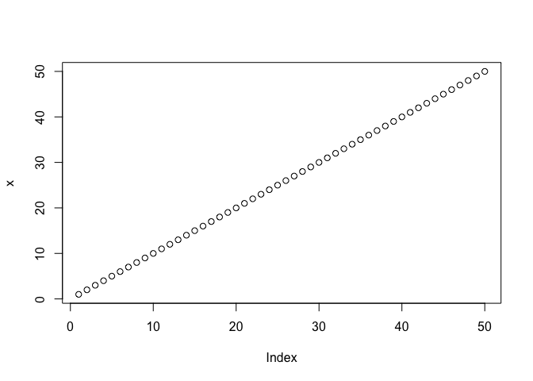
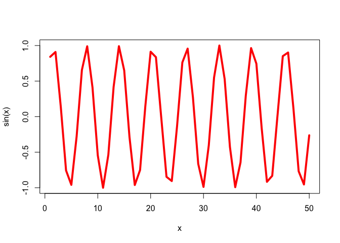
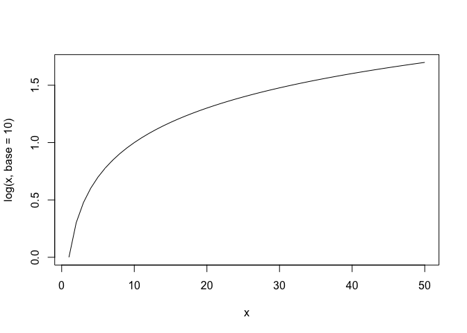

# BGGN213 Lab04
Qingyun Zheng

``` r
#This is my first R script
x <- 1:50
plot(x)
```



``` r
plot(x,type = "b", color = "green")
```

    Warning in plot.window(...): "color" is not a graphical parameter

    Warning in plot.xy(xy, type, ...): "color" is not a graphical parameter

    Warning in axis(side = side, at = at, labels = labels, ...): "color" is not a
    graphical parameter
    Warning in axis(side = side, at = at, labels = labels, ...): "color" is not a
    graphical parameter

    Warning in box(...): "color" is not a graphical parameter

    Warning in title(...): "color" is not a graphical parameter


``` r
plot(x, sin(x), col = "red", type = "l", lwd = 4)
```



``` r
log(10)
```

    [1] 2.302585

``` r
log(exp(1))
```

    [1] 1

``` r
log(10, base = 10)
```

    [1] 1

``` r
plot(x,log(x, base = 10), type = "l")
```


